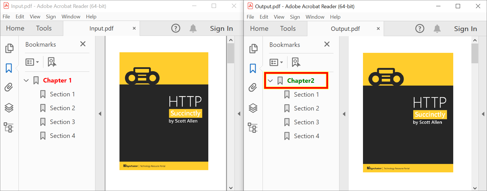

# How to Add Watermarks and Bookmarks in .NET using the PDF Library

## Introduction
A quick start .NET console project that shows how to add watermarks and bookmarks to a PDF document using the Syncfusion® PDF Library.

## System requirement
**Framework and SDKs**
* .NET SDK (version 5.0 or later)

**IDEs**
*  Visual Studio 2019/ Visual Studio 2022

## Add a text watermark to a PDF document
We will create a new .NET console application, add the Syncfusion® PDF library package, and write the code

```csharp
//Get stream from an existing PDF document. 
FileStream docStream = new FileStream("Input.pdf", FileMode.Open, FileAccess.Read);
//Load the PDF document. 
PdfLoadedDocument loadedDocument = new PdfLoadedDocument(docStream);
//Load the page. 
PdfPageBase loadedPage = loadedDocument.Pages[0];
//Create graphics for PDF page. 
PdfGraphics graphics = loadedPage.Graphics;
//Set the font.
PdfFont font = new PdfStandardFont(PdfFontFamily.Helvetica, 20);
//Watermark text.
PdfGraphicsState state = graphics.Save();
//Set transparency and rotate transform to page graphics. 
graphics.SetTransparency(0.25f);
graphics.RotateTransform(-40);
//Draw watermark text in the PDF document. 
graphics.DrawString("Imported using Essential PDF", font, PdfPens.Red, PdfBrushes.Red, new PointF(-150, 450));

//Create file stream.
using (FileStream outputFileStream = new FileStream("Output.pdf", FileMode.Create, FileAccess.ReadWrite)) {
    //Save the PDF document to file stream.
    loadedDocument.Save(outputFileStream);
}
//Close the document.
loadedDocument.Close(true);
```

Execute this code example to get a text watermark in PDF document like in the following screenshot.


## Add an image watermark
We will create a new .NET console application, add the Syncfusion® PDF library package, and write the code

```csharp
//Get stream from an existing PDF document. 
FileStream docStream = new FileStream("Input.pdf", FileMode.Open, FileAccess.Read);
//Load the PDF document. 
PdfLoadedDocument loadedDocument = new PdfLoadedDocument(docStream);
//Load the page. 
PdfPageBase loadedPage = loadedDocument.Pages[0];
//Create graphics for PDF page. 
PdfGraphics graphics = loadedPage.Graphics;
//Load the image file as stream.
FileStream imageStream = new FileStream("Image.png", FileMode.Open, FileAccess.Read);
//Load the image file.
PdfImage image = new PdfBitmap(imageStream);
//Create state for page graphics. 
PdfGraphicsState state = graphics.Save();
//Set transparency for page graphics. 
graphics.SetTransparency(0.25f);
//Draw image watermark in PDF page. 
graphics.DrawImage(image, new PointF(0, 0), loadedPage.Graphics.ClientSize);

//Create file stream.
using (FileStream outputFileStream = new FileStream("Output.pdf", FileMode.Create, FileAccess.ReadWrite)) {
    //Save the PDF document to file stream.
    loadedDocument.Save(outputFileStream);
}
//Close the document.
loadedDocument.Close(true);
```

Execute this code example to get an image watermark in PDF document like in the following screenshot.


## Remove a watermark
We will create a new .NET console application, add the Syncfusion® PDF library package, and write the code

```csharp
//Get stream from an existing PDF document. 
FileStream docStream = new FileStream("Data.pdf", FileMode.Open, FileAccess.Read);
//Load the PDF document. 
PdfLoadedDocument loadedDocument = new PdfLoadedDocument(docStream);
for (int i = 0; i < loadedDocument.Pages.Count; i++) {
    //Get the page.  
    PdfLoadedPage lpage = loadedDocument.Pages[i] as PdfLoadedPage;
    //Gets the annotation collection. 
    PdfLoadedAnnotationCollection loadedAnnotationCollection = lpage.Annotations;
    for (int j = 0; j < loadedAnnotationCollection.Count; j++) {
        //Gets the annotation. 
        PdfLoadedAnnotation annotation = lpage.Annotations[j] as PdfLoadedAnnotation;
        if (annotation != null && annotation is PdfLoadedWatermarkAnnotation) {
            //Removes the first annotation. 
            loadedAnnotationCollection.RemoveAt(j);
        }
    }
}

//Create file stream.
using (FileStream outputFileStream = new FileStream("Output.pdf", FileMode.Create, FileAccess.ReadWrite)) {
    //Save the PDF document to file stream.
    loadedDocument.Save(outputFileStream);
}
//Close the document.
loadedDocument.Close(true);
```

Execute this code example to get a remove watermark in PDF document like in the following screenshot.


## Add bookmarks to a PDF document
We will create a new .NET console application, add the Syncfusion&reg; PDF library package, and write the code

```csharp
//Load an existing PDF document.
FileStream docStream = new FileStream("Input.pdf", FileMode.Open, FileAccess.Read);
PdfLoadedDocument document = new PdfLoadedDocument(docStream);
//Creates parent bookmark.
PdfBookmark bookmark = document.Bookmarks.Add("Chapter 1");
//Sets the destination page.
bookmark.Destination = new PdfDestination(document.Pages[1]);
//Sets the text style and color for parent bookmark.
bookmark.TextStyle = PdfTextStyle.Bold;
bookmark.Color = Color.Red;
//Sets the destination location for parent bookmark. 
bookmark.Destination.Location = new PointF(20, 20);
//Adds the child bookmark.
PdfBookmark childBookmark = bookmark.Insert(0, "Section 1");
//Sets the destination location for child bookmark. 
childBookmark.Destination = new PdfDestination(document.Pages[1]);
childBookmark.Destination.Location = new PointF(0, 200);

//Create file stream.
using (FileStream outputFileStream = new FileStream("Output.pdf", FileMode.Create, FileAccess.ReadWrite)) {
    //Save the PDF document to file stream.
    document.Save(outputFileStream);
}
//Close the document.
document.Close(true);
```

By executing this code example, you will get a PDF document like the following screenshot.


## Insert bookmarks in an existing PDF document
We will create a new .NET console application, add the Syncfusion&reg; PDF library package, and write the code

```csharp
//Load the PDF document.
FileStream docStream = new FileStream("Data.pdf", FileMode.Open, FileAccess.Read);
PdfLoadedDocument document = new PdfLoadedDocument(docStream);
//Inserts a new bookmark in the existing bookmark collection.
PdfBookmark bookmark = document.Bookmarks.Insert(0, "Title Page");
//Sets the destination page and location.
bookmark.Destination = new PdfDestination(document.Pages[0]);
bookmark.Destination.Location = new PointF(0, 0);
//Sets the text style and color.
bookmark.TextStyle = PdfTextStyle.Bold;
bookmark.Color = Color.Green;

//Create file stream.
using (FileStream outputFileStream = new FileStream("Output.pdf", FileMode.Create, FileAccess.ReadWrite)) {
    //Save the PDF document to file stream.
    document.Save(outputFileStream);
}
//Close the document.
document.Close(true);
```

By executing this code example, you will get a PDF document like the following screenshot.


## Modify bookmarks
We will create a new .NET console application, add the Syncfusion&reg; PDF library package, and write the code

```csharp
//Load the PDF document.
FileStream docStream = new FileStream("Data.pdf", FileMode.Open, FileAccess.Read);
PdfLoadedDocument document = new PdfLoadedDocument(docStream);
//Gets all the bookmarks.
PdfBookmarkBase bookmarks = document.Bookmarks;
//Gets the first bookmark and changes the properties of the bookmark.
PdfLoadedBookmark bookmark = bookmarks[0] as PdfLoadedBookmark;
bookmark.Destination = new PdfDestination(document.Pages[2]);
bookmark.Color = Color.Green;
bookmark.TextStyle = PdfTextStyle.Bold;
bookmark.Title = "Chapter2";

//Create file stream.
using (FileStream outputFileStream = new FileStream("Output.pdf", FileMode.Create, FileAccess.ReadWrite)) {
    //Save the PDF document to file stream.
    document.Save(outputFileStream);
}
//Close the document.
document.Close(true);
```

By executing this code example, you will get a PDF document like the following screenshot.


## Remove bookmarks
We will create a new .NET console application, add the Syncfusion&reg; PDF library package, and write the code

```csharp
 //Load the PDF document.
FileStream docStream = new FileStream("Input.pdf", FileMode.Open, FileAccess.Read);
PdfLoadedDocument document = new PdfLoadedDocument(docStream);
//Gets all the bookmarks.
PdfBookmarkBase bookmarks = document.Bookmarks;
//Remove parent bookmark by index.
bookmarks.RemoveAt(1);
//Remove child bookmark by bookmark name. 
PdfLoadedBookmark parentBookmark = bookmarks[0] as PdfLoadedBookmark;
parentBookmark.Remove("Section 4");

//Create file stream.
using (FileStream outputFileStream = new FileStream("Output.pdf", FileMode.Create, FileAccess.ReadWrite)) {
    //Save the PDF document to file stream.
    document.Save(outputFileStream);
}
//Close the document.
document.Close(true);
```

By executing this code example, you will get a PDF document like the following screenshot.


## How to run the examples
* Download this project to a location in your disk. 
* Open the solution file using Visual Studio. 
* Rebuild the solution to install the required NuGet package. 
* Run the application.

## Resources
*   **Product page:** [Syncfusion&reg; PDF Framework](https://www.syncfusion.com/document-processing/pdf-framework/net)
*   **Documentation page:** [Syncfusion&reg; .NET PDF library](https://help.syncfusion.com/file-formats/pdf/overview)
*   **Online demo:** [Syncfusion&reg; .NET PDF library - Online demos](https://ej2.syncfusion.com/aspnetcore/PDF/CompressExistingPDF#/bootstrap5)
*   **Blog:** [Syncfusion&reg; .NET PDF library - Blog](https://www.syncfusion.com/blogs/category/pdf)
*   **Knowledge Base:** [Syncfusion&reg; .NET PDF library - Knowledge Base](https://www.syncfusion.com/kb/windowsforms/pdf)
*   **EBooks:** [Syncfusion&reg; .NET PDF library - EBooks](https://www.syncfusion.com/succinctly-free-ebooks)
*   **FAQ:** [Syncfusion&reg; .NET PDF library - FAQ](https://www.syncfusion.com/faq/)

## Support and feedback
*   For any other queries, reach our [Syncfusion&reg; support team](https://www.syncfusion.com/support/directtrac/incidents/newincident?utm_source=github&utm_medium=listing&utm_campaign=github-docio-examples) or post the queries through the [community forums](https://www.syncfusion.com/forums?utm_source=github&utm_medium=listing&utm_campaign=github-docio-examples).
*   Request new feature through [Syncfusion&reg; feedback portal](https://www.syncfusion.com/feedback?utm_source=github&utm_medium=listing&utm_campaign=github-docio-examples).

## License
This is a commercial product and requires a paid license for possession or use. Syncfusion’s licensed software, including this component, is subject to the terms and conditions of [Syncfusion's EULA](https://www.syncfusion.com/eula/es/?utm_source=github&utm_medium=listing&utm_campaign=github-docio-examples). You can purchase a licnense [here](https://www.syncfusion.com/sales/products?utm_source=github&utm_medium=listing&utm_campaign=github-docio-examples) or start a free 30-day trial [here](https://www.syncfusion.com/account/manage-trials/start-trials?utm_source=github&utm_medium=listing&utm_campaign=github-docio-examples).

## About Syncfusion&reg;
Founded in 2001 and headquartered in Research Triangle Park, N.C., Syncfusion&reg; has more than 26,000+ customers and more than 1 million users, including large financial institutions, Fortune 500 companies, and global IT consultancies.

Today, we provide 1600+ components and frameworks for web ([Blazor](https://www.syncfusion.com/blazor-components?utm_source=github&utm_medium=listing&utm_campaign=github-docio-examples), [ASP.NET Core](https://www.syncfusion.com/aspnet-core-ui-controls?utm_source=github&utm_medium=listing&utm_campaign=github-docio-examples), [ASP.NET MVC](https://www.syncfusion.com/aspnet-mvc-ui-controls?utm_source=github&utm_medium=listing&utm_campaign=github-docio-examples), [ASP.NET WebForms](https://www.syncfusion.com/jquery/aspnet-webforms-ui-controls?utm_source=github&utm_medium=listing&utm_campaign=github-docio-examples), [JavaScript](https://www.syncfusion.com/javascript-ui-controls?utm_source=github&utm_medium=listing&utm_campaign=github-docio-examples), [Angular](https://www.syncfusion.com/angular-ui-components?utm_source=github&utm_medium=listing&utm_campaign=github-docio-examples), [React](https://www.syncfusion.com/react-ui-components?utm_source=github&utm_medium=listing&utm_campaign=github-docio-examples), [Vue](https://www.syncfusion.com/vue-ui-components?utm_source=github&utm_medium=listing&utm_campaign=github-docio-examples), and [Flutter](https://www.syncfusion.com/flutter-widgets?utm_source=github&utm_medium=listing&utm_campaign=github-docio-examples)), mobile ([Xamarin](https://www.syncfusion.com/xamarin-ui-controls?utm_source=github&utm_medium=listing&utm_campaign=github-docio-examples), [Flutter](https://www.syncfusion.com/flutter-widgets?utm_source=github&utm_medium=listing&utm_campaign=github-docio-examples), [UWP](https://www.syncfusion.com/uwp-ui-controls?utm_source=github&utm_medium=listing&utm_campaign=github-docio-examples), and [JavaScript](https://www.syncfusion.com/javascript-ui-controls?utm_source=github&utm_medium=listing&utm_campaign=github-docio-examples)), and desktop development ([WinForms](https://www.syncfusion.com/winforms-ui-controls?utm_source=github&utm_medium=listing&utm_campaign=github-docio-examples), [WPF](https://www.syncfusion.com/wpf-ui-controls?utm_source=github&utm_medium=listing&utm_campaign=github-docio-examples), [WinUI(Preview)](https://www.syncfusion.com/winui-controls?utm_source=github&utm_medium=listing&utm_campaign=github-docio-examples), [Flutter](https://www.syncfusion.com/flutter-widgets?utm_source=github&utm_medium=listing&utm_campaign=github-docio-examples) and [UWP](https://www.syncfusion.com/uwp-ui-controls?utm_source=github&utm_medium=listing&utm_campaign=github-docio-examples)). We provide ready-to-deploy enterprise software for dashboards, reports, data integration, and big data processing. Many customers have saved millions in licensing fees by deploying our software.